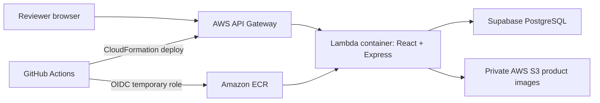
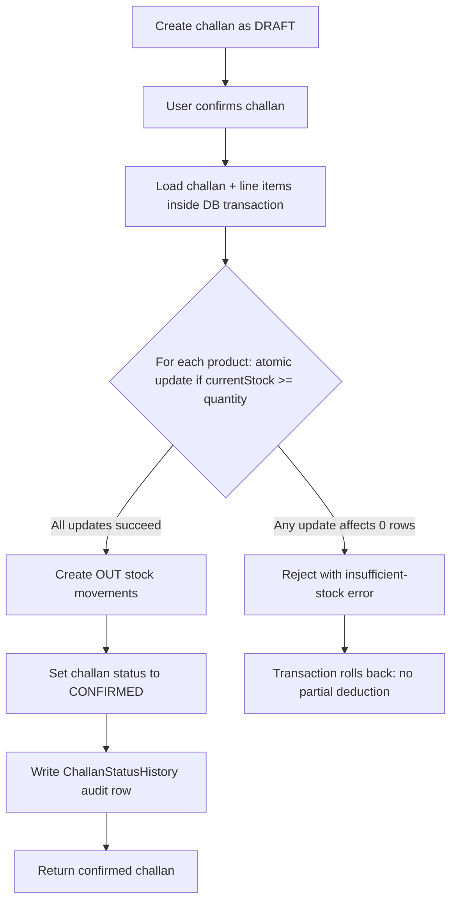
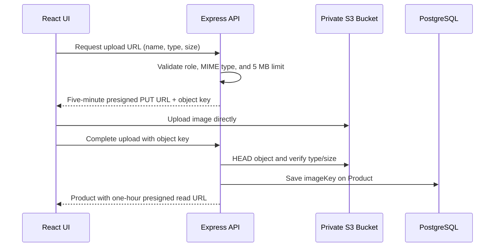

# StockFlow Architecture

StockFlow is a mini ERP + CRM portal for wholesale inventory, customer follow-ups, sales challans, and role-based operations. The system is split into a React frontend, an Express API, and PostgreSQL accessed through Prisma.

## Core Modules

- **CRM**: customers, priorities, statuses, follow-up notes, account history, and customer-wise challan context.
- **Inventory**: products, stock thresholds, stock movement ledger, low-stock filtering, and warehouse/location views.
- **Product Media**: private AWS S3 objects with presigned browser uploads and short-lived read access.
- **Sales Challans**: draft creation, confirmation, cancellation, status history, PDF generation, and challan-time item snapshots.
- **Admin**: JWT login, roles, user management, activity logging, and access boundaries.
- **Operations Dashboard**: KPIs, follow-up queue, low-stock alerts, recent challans, and audit visibility.

## AWS Deployment Topology



The production container serves the compiled React application and Express API through one API Gateway origin. This avoids an always-on server while preserving the existing Vercel and Render deployment as a fallback. Infrastructure is declared in CloudFormation, and every `main` deployment is gated by tests, application builds, Docker builds, database migration, and a production smoke test.

GitHub does not store long-lived AWS access keys. Its workflow exchanges GitHub's OIDC identity for a short-lived, repository- and branch-scoped AWS role. Lambda uses its own execution role for private S3 access, including the temporary session token required when signing browser uploads.

## Challan Confirmation Flow



## Concurrency Decision

The first implementation checked product stock and then decremented it later in the same transaction. That is correct for a single user, but under concurrent confirmations two requests could both read the same available stock before either write completed.

The confirmation path now uses a conditional atomic update:

```ts
await tx.product.updateMany({
  where: { id: item.productId, currentStock: { gte: item.quantity } },
  data: { currentStock: { decrement: item.quantity } }
});
```

If the update affects `0` rows, the API rejects the confirmation with an insufficient-stock error. Because this happens inside the transaction, any earlier deductions from the same confirmation are rolled back.

## Challan Number Safety

Challan numbers are generated inside the create transaction and protected with retry handling for unique-key collisions. This keeps the human-readable format (`CH-2026-00001`) while avoiding a hard failure when two challans are created at nearly the same time.

## Private Product Image Flow



The bucket remains private with Block Public Access enabled. AWS credentials exist only in the API environment, are scoped to the `products/*` prefix, and are never sent to the browser.

## API Maturity

- `GET /health` checks database reachability and required environment configuration.
- `GET /openapi.json` exposes the API contract.
- `GET /docs` serves interactive Swagger documentation.
- `/auth/login` has a stricter rate limit.
- all API routes have a lighter general request limiter.
